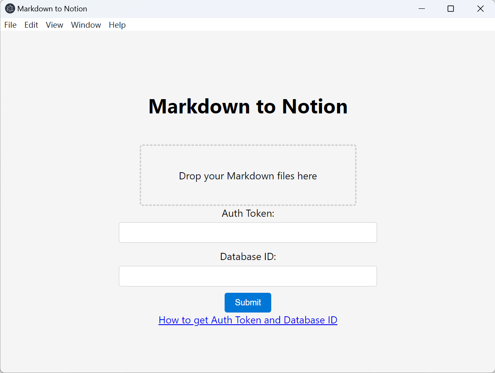

# Markdown to Notion

Import markdown to notion using [Martian](https://github.com/tryfabric/martian) and [Notion SDK for JavaScript](https://github.com/makenotion/notion-sdk-js).

Support equations and other markdown elements in [Martian](https://github.com/tryfabric/martian).



## Usage

Download from [release](https://github.com/huisui773/md2notion/releases/) page.

Or download `md2notion.js` and use cli:

```sh
npm install @notionhq/client
npm install @tryfabric/martian
```

```sh
node md2notion.js -a <auth> -d <database> -f <file>
# or
node md2notion.js --auth <auth> --database <database> --file <file>
```

- \<auth\>: Notion integration token
- \<database\>: database id
- \<file\>: filename
